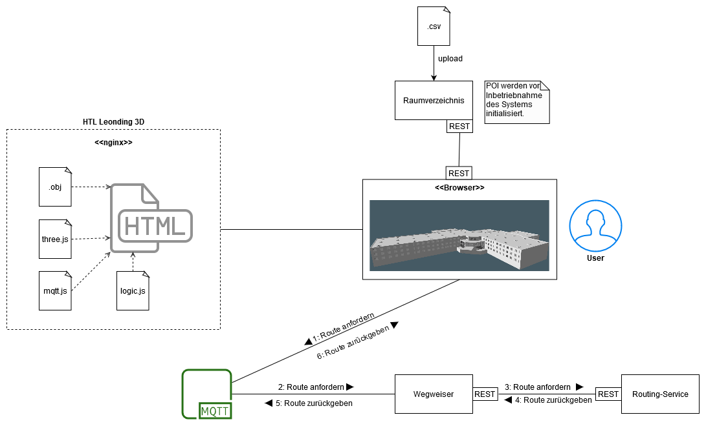

# HTL-Leonding-3D-TADEOT-leonie
Dieses Repository beinhaltet eine Version für den Tag der offenen Tür mit Leonie Integration.
Das bedeutet konkret dass damit mit MQTT Nachrichten von der Leonie im Schulmodell umgesetzt werden.

**Beispiel:** Ein Nutzer fragt die Leonie wo der "Roboterführerschein" ist. Im Hintergrund sendet Leonie per
MQTT eine Nachricht an das [Backend](Pathfinder). Von dort aus wird ein REST-Request an die NEO4J Datenbank
geschickt um den kürzesten Weg dorthin zu bekommen. Anschließend wird wieder über das Backend die Route an
das Schulmodell geschickt und dort animiert beziehungsweise der Weg bis zur Station eingezeichnet.

### Wichtige Adressen
**NEO4J-Datenbank:** http://vm90.htl-leonding.ac.at:8080/path/shortest?start={STARTPUNKT}&end={ZIEL}

**Leonie MQTT-Broker:** tcp://leonie.htl-leonding.ac.at:1883

Die wichtigsten Informationen über den Programmablauf entnehmen Sie bitte [hier](Pathfinder/src/main/java/at/htl/InitBean.java) 

## Systemarchitektur
Mit dieser Grafik wird der oben beschriebende Prozess noch ein mal bildlich dargestellt und vereinfacht.
